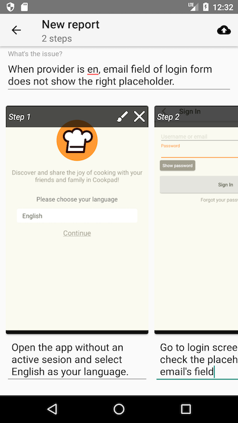
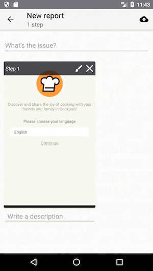
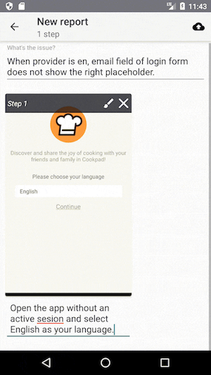
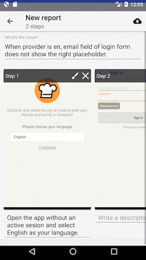
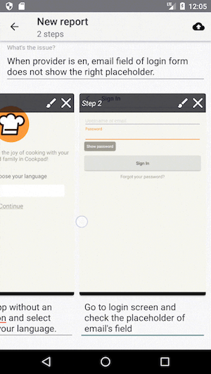
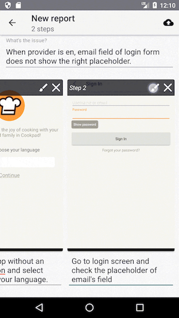
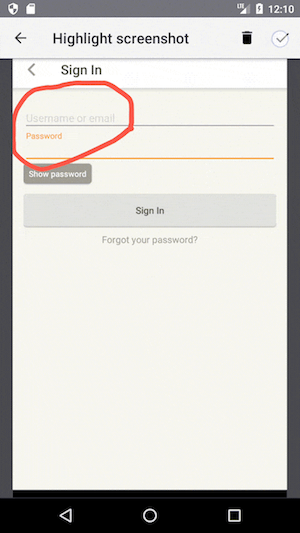
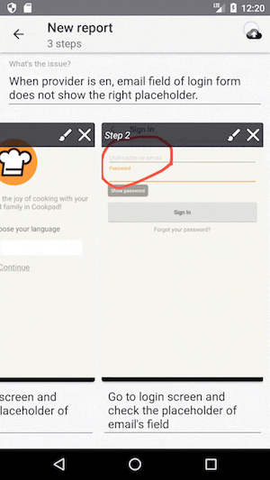
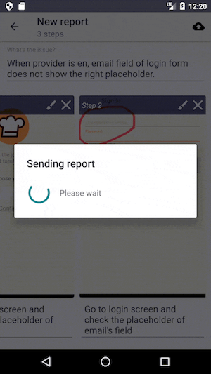
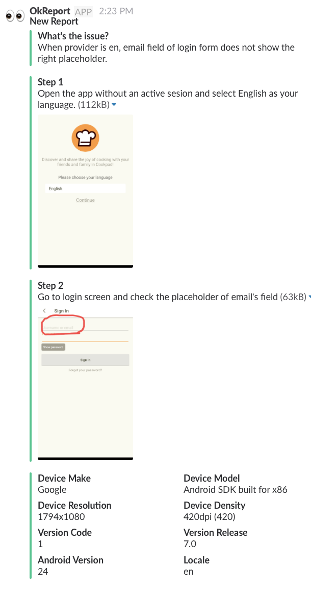

# OkReport

An **Android library** which **allows testers to submit reports without living the app**.

Because not all bugs are easy to catch, because not all bugs end with a clean reported crash on some fancy console as the result of a nice pipeline settled for logging exceptions. That's it, **there is always some wrong behaviour which can not be typified as a bug per se**; and therefore, it requires the **supervision of a human eye** to acknowledge it as a malfunction of the system. **OkReport is the perfect tool for tracking that**.



## Features
* **Write reports organically within the app**, without loosing the context which is precisely the source of the problem and therefore it has to be properly tamed.
* Allows to plug in **custom implementations for [Reporter](#reporter)**
* **Built-in no-op versions** that can be used in release builds.
* **A minimal-user-friendly UI**


## Setup
Add to top level *gradle.build* file

```gradle
allprojects {
    repositories {
        maven { url "https://jitpack.io" }
    }
}
```

Add to app module *gradle.build* file
```gradle
dependencies {
	compile 'com.github.cookpad:OkReport:core:0.0.5'

	//Square lib to rely on for triggering the report screen when the device is shaken
	compile 'com.squareup:seismic:1.0.2'

	//Post the report on a Slack channel
	debugCompile 'com.github.cookpad:OkReport:slack_reporter:0.0.5'
   	releaseCompile 'com.github.cookpad:OkReport:slack_reporter_no_op:0.0.5'
}
```

## Usage

### Init and configure OkReport

```kotlin
class OkReportApp : Application() {

    override fun onCreate() {
        super.onCreate()

        // Posts the data retrieved from OkReport into a Slack channel.
        val slackReporter = slackReporter()

        // Entry point to start OkReport. Call it just one time per life-time application.
        val okReport = initOkReport(this, slackReporter)

        // Triggers the report screen when the device is shaken.
        val sensorManager = this.getSystemService(Context.SENSOR_SERVICE) as SensorManager
        ShakeDetector({ okReport.trigger() }).start(sensorManager)
    }

    private fun slackReporter() : Reporter {

        // Slack's token required to upload the images to Slack hosts. Go to https://api.slack.com/custom-integrations/legacy-tokens and create one.
        val legacyToken = ""

        // Webhook's url in which SlackReporter relies to perform the publishing report. Go to https://api.slack.com/incoming-webhooks and create one.
        val webhookURL = ""

        // Name or id of the channel where report's image should be published. See limitation section for more details.
        val channelImages = "image_noise"

        // Handy information about the device and the build version, such us device model, locale or current version code.
        val deviceSpecs = collectDeviceSpecs(this)

        // False by default, if true, it triggers desktop and push notifications to all team members in the channel where the report has been posted.
        val notifyChannel = true

        return SlackReporter(legacyToken, webhookURL, collectDeviceSpecs(this), channelImages, notifyChannel)
    }
}
```

### <a name="ok_report_workflow"></a> OkReport's workflow

1. #### Go to an app's section, shake the device, explain the issue and describe the step.

 

2. #### Add as much steps as required following the previous instruction.

 

3. #### If required, highlight some area of the screenshot

 

4. #### Submit the report

 

#### This is how the report looks on Slack's channel.



## Customization

### <a name="reporter"></a> Reporter
OkReport logs reports by delegating this responsibility to a given `Reporter`. By adding `slack_reporter` module, OkReport posts the data retrieved from OkReport into a Slack channel. But **clients can supply their own implementation if other logger mechanism is required.**

If you consider that some Reporter may be interesting to add to this lib, please submit a PR as a new separate module with its own no-op version. **`Reporter` is the `interface` that has be implemented to fulfill the contract**:

```kotlin
class CustomReporter() : Reporter {
    override fun sendReport(report: Report, reporterCallback: ReporterCallback) {
        //Take report's data and send it whatever you want.
        val response = someServer.sendReport(report)

        //And let know OkReport about the result
        if (response.ok) {
            reporterCallback.success("ok")
        } else {
            reporterCallback.error(RuntimeException("ko"))
        }
    }
}

initOkReport(this, CustomReporter())
```

## Credits
* Highlight screenshots: [Ink](https://github.com/simplifycom/ink-android). A light-weight, customizable view for capturing a signature or drawing in an Android app.
* Trigger gesture: [Seismic](https://github.com/square/seismic). Android device shake detection.

## Limitations
* OkReport is **not meant to be used as a way of getting feedback from final users on production environment**, it rather should be conceived as a communication tool to facilitate internal reporting.
* Slack's api presents a limitation for legacy tokens: **it's not possible to show an image on a posted message without been previously shared on a channel's organization**. That's why when you're creating an instance of `SlackReporter` you must to supply the name or id of an already existing channel¡s organization where images will be posted isolatedly.
